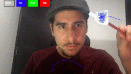
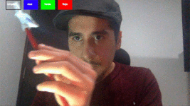
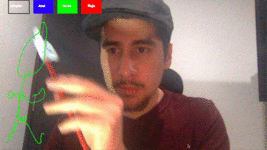
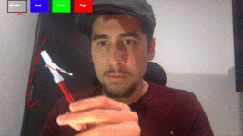

# Air Camboard

Seguimiento de color para generar tablero en cámara.

## Uso

1. Ejecutar script.
```
python aircamboard.py
```
2. Utilizar cualquier objeto azul como herramienta de dibujo (Se recomienda utilizar un papel pintado, en la punta de un lápiz común).
3. Seleccionar colores para dibujar o limpiar.

## Demo


